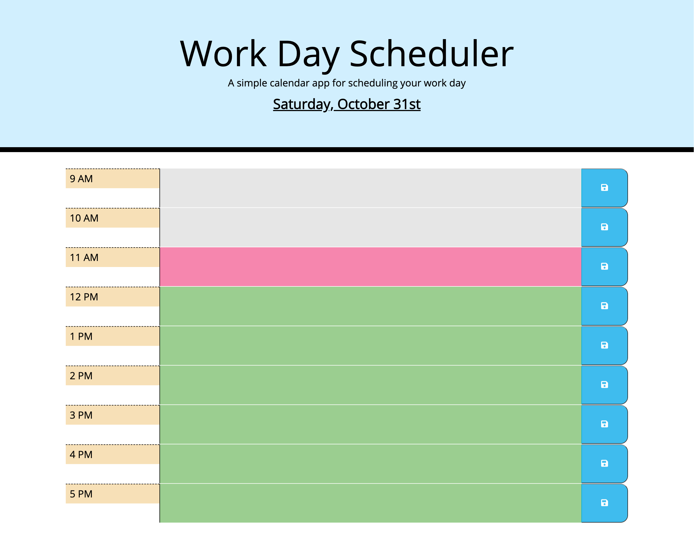

# Work Day Scheduler Powered By jQuery

## Description

This is a simple calendar application that allows a user to save events for each hour of the day by modifying starter code. This app runs in the browser and features dynamically updated HTML and CSS powered by jQuery. Employees oftentimes have very busy schdules and utilize a daily planner in order to manage their time effectively.

### How it Works

Given that an individual would like to use a daily planner to create a schedule...

1. When you open the planner, the current day is displayed at the top of the calendar
2. When you scroll down the webpage, you will be presented with time blocks for standard business hours (9am-5pm). Each time block is color-coded to indicate whether it is in the past, present, or future
3. When you click into a time block, you can enter an event
4. When you click the save button for that time block, the text for that event is saved in local storage
5. When you refresh the page, the saved events persist

### Mock-Up

The following animation and screenshot demonstrates the application functionality:

## Table of Contents

- [Installation](#installation)
- [Usage](#usage)
- [Credits](#credits)
- [License](#license)

## Installation

You'll need to use the [**Moment.js**](https://momentjs.com/) library to work with date and time. Be sure to read the documentation carefully and concentrate on using Moment.js in the browser.
To install this project locally clone this [**project repository**](https://github.com/kaylamuraoka/Work_Day_Scheduler_Using_jQuery) to your local terminal and modify the code to your liking.

## Usage

This simple calendar application can be viewed at: [**this link**](https://kaylamuraoka.github.io/Work_Day_Scheduler_Using_jQuery/).

## Credits

The original webpage skeleton and basic style templete (index.html and style.css) was provided on behalf of the UC Berkeley Coding Bootcamp, which I then enhanced.

## License

This project is licensed under [**GNU GPL v3**](https://choosealicense.com/licenses/gpl-3.0/).
